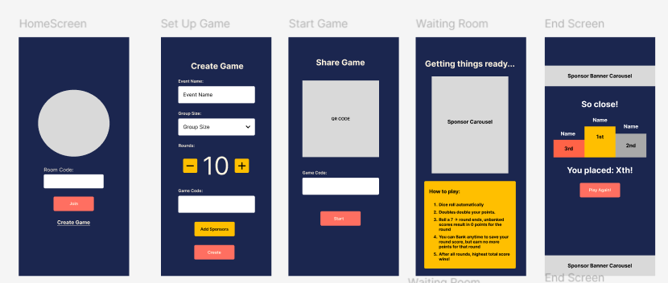
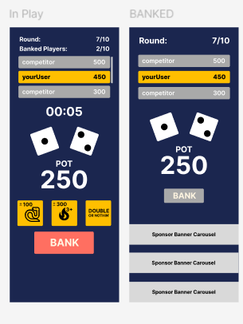

# Arena Bank

**Arena Bank** is a party game app built with [React Native](https://reactnative.dev/) and [Expo](https://expo.dev/), designed for large gatherings. Players join a shared game of "bank", but with a twist. This isn’t your traditional bank! We’ve added power-ups, timed rolls, and custom game logic to make the experience more fast-paced, chaotic, and fun.

Whether you're at a family reunion, game night, or party, **Arena Bank** makes it easy to dive into group fun with just a smartphone.

---

## Features

- **Join Multiplayer Games** — Players connect and play together in real time.
- **Timed Rolls** — Keep the pace fast and strategic.
- **Power-Ups** — Add unpredictable elements to keep everyone on their toes.
- **Arena-Style Gameplay** — Designed for dynamic, in-person party environments.
- **Local Storage** — Helps save user data

---

## Tech Stack

This app is built with a powerful combination of tools:

### Core

- [`expo`](https://expo.dev/) – Fast development and easy deployment
- [`react-native`](https://reactnative.dev/) – Native mobile development

### Navigation & UI

- `expo-router` – File-based routing system for screens
- `@react-navigation/native`, `bottom-tabs`, `elements` – Smooth and flexible navigation
- `react-native-paper`, `@expo/vector-icons`, `react-native-vector-icons` – Modern Material Design components and icons
- `react-native-dropdown-picker` – For clean and interactive dropdowns

### Real-Time Communication

- `socket.io` & `socket.io-client` – Live multiplayer syncing and event broadcasting

### Backend

The backend is currently **a work in progress** and will eventually support game state management, player matchmaking, persistent data, and more using:

- `express`
- `firebase`
- `cors`
- `websockets`

---

## Design Principles

### 1. Consistent Layout and Hierarchy

**Material Design** emphasizes clear visual hierarchy through typography, spacing, and alignment. For example, it recommends using distinct typographic styles to indicate screen structure and importance.

- In my app, I apply `fontSize: 32` and `fontWeight: "bold"` to page titles to follow Material Design’s guidelines on headline emphasis.
- Layouts are centered using `alignItems: "center"` and `marginHorizontal: "auto"`, promoting visual balance and consistency, which Material Design encourages for clear structure and readability.

**Apple’s Human Interface Guidelines (HIG)** also stress clarity and consistency. They encourage placing key content in predictable locations and maintaining alignment across views.

- My app aligns titles and main actions centrally, respecting HIG’s emphasis on simplicity and alignment.
- Repeated layout patterns ensure familiarity as recommended by HIG, making navigation more intuitive.

### 2. Use of Elevation & Color Contrast

**Material Design** uses elevation and contrast to establish hierarchy and distinguish elements from the background.

- The `StyledButton` component uses `react-native-paper`’s `Button` with `mode="contained"`, providing elevation and a strong visual anchor per Material guidelines.
- Theming is applied using a consistent background color (`#FF6F61`) and padded touch targets (`paddingVertical: 12`, `fontSize: 18`), which align with Material’s accessibility and interaction guidelines.

**HIG** promotes legibility and distinct touch targets with sufficient contrast.

- Input fields in the app use a white background with light grey borders, ensuring contrast and clear focus indicators in accordance with HIG.
- Text and touchable areas maintain comfortable sizing and spacing, consistent with both Material and HIG recommendations for tappable areas.

### 3. Spacing and Padding

**Material Design** emphasizes the use of whitespace to reduce cognitive load and improve focus.

- I apply consistent padding (`padding: 15`) and spacing (`marginBottom`) across components, which reflects Material Design’s principles for organizing content clearly and reducing clutter.

**HIG** also highlights the importance of using adequate spacing to separate controls and content.

- These spacing patterns make the UI feel open and approachable, helping users distinguish between related and unrelated elements as recommended by HIG.

### 4. Use of Modals

Both **Material Design** and **Apple’s Human Interface Guidelines (HIG)** provide clear recommendations:

- **Material Design** emphasizes that modal dialogs should use motion to guide attention without being disruptive. The `animationType="slide"` aligns with their motion principles by creating a natural transition that helps the user understand context without surprise.
- **HIG** similarly encourages smooth and intuitive transitions. The slide animation supports the iOS expectation of continuity and spatial awareness.
- Using a **semi-transparent backdrop** (`rgba(0, 0, 0, 0.7)`) directly reflects **Material Design’s recommendation** to dim the background behind a modal, focusing the user’s attention on the modal content. This is used on my game over modal.
- The **rounded corners and centered modal layout** match **HIG’s visual design suggestions** for sheets, alerts, and popovers.

---

### 5. Color and Contrast

**Material Design** and **HIG** both stress the importance of color contrast for readability and accessibility:

- My design uses **light text on dark backgrounds** (e.g., white on black/grey), which maintains **WCAG-compliant contrast ratios** — a core accessibility principle supported by both design systems.
- Highlighting top leaderboard users with **`backgroundColor: "#FFD700"` (gold)** is a technique endorsed by both systems:
  - **Material Design** encourages the use of color to draw focus to key UI elements and feedback states.
  - **HIG** suggests using contrast and distinct colors to communicate emphasis and interactivity without overwhelming the user.

---

### 6. Feedback and State Changes

Both design systems emphasize **immediate and meaningful feedback** for user actions:

- **Material Design** groups feedback under **"Motion" and "Interaction"** guidelines, which recommend updating the UI in response to user input using visual cues. My app does this by providing real-time changes (e.g., updated message logs, leaderboard updates, game over modals).
- **HIG’s “User Control and Feedback” principle** advises showing timely feedback and keeping the user informed of current states. My app's use of modals and action-based updates (e.g., player banking) ensures the player is informed.
- Transitions between game rounds and visual responses (like the appearance of the Game Over modal) help create a responsive and intuitive game loop, matching both platforms' expectations for interactivity.

---

## WireFrames

